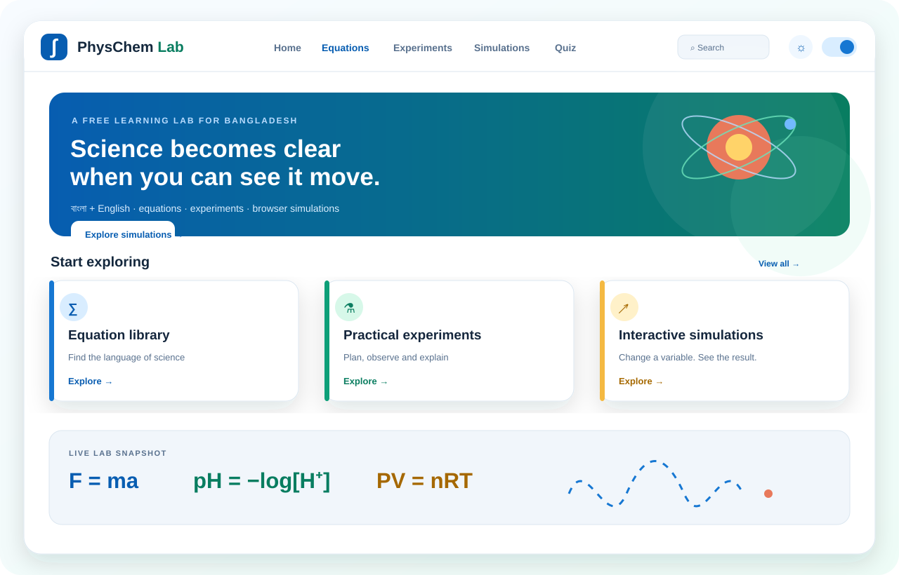
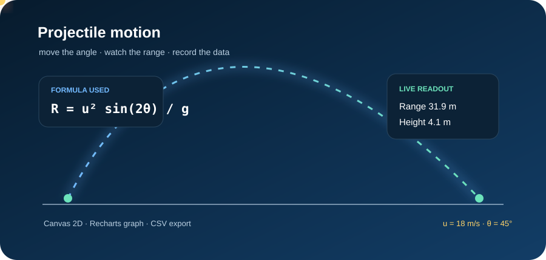
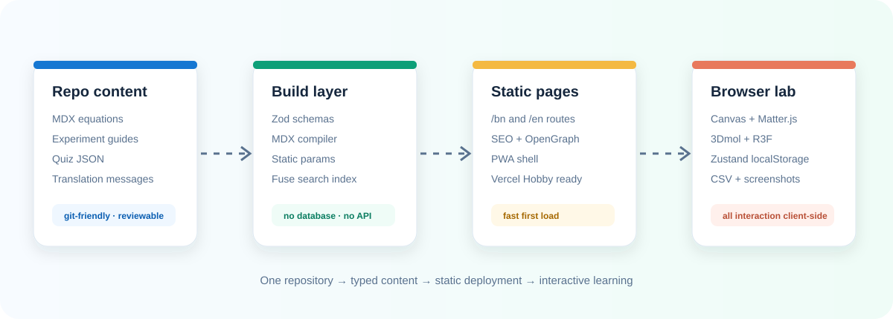

# PhysChem Lab

<p align="center">
  
</p>

<p align="center">
  <strong>Learn it. See it. Try it.</strong><br />
  A free bilingual browser laboratory for physics and chemistry learners in Bangladesh.
</p>

<p align="center">
  <a href="/BFH-HAMID/Elementa/actions"></a>
  <a href="https://nextjs.org/"></a>
  <a href="https://www.typescriptlang.org/"></a>
  <a href="LICENSE"></a>
</p>

<p align="center">
  <a href="https://physchem-lab.vercel.app/bn">বাংলা সংস্করণ</a> ·
  <a href="https://physchem-lab.vercel.app/en">English version</a> ·
  <a href="https://github.com/BFH-HAMID/Elementa/pulls">Contribute</a>
</p>

PhysChem Lab is a free, bilingual (Bangla + English) physics and chemistry learning platform for Bangladesh. It combines original equation notes, practical experiment guides, short quizzes and interactive browser simulations for NCTB Classes 6–12 through an introductory National University Honours level.

> **বাংলায়:** সূত্র শুধু মুখস্থ নয় — পরিবর্তন করুন, পর্যবেক্ষণ করুন, এবং নিজের ব্যাখ্যা তৈরি করুন।

## Visual tour

The README uses self-hosted SVG artwork so the project page has a visual identity without depending on a screenshot CDN. The hero and simulation previews include lightweight SVG motion; browsers that respect `prefers-reduced-motion` see the same artwork without looping animation.

<table>
  <tr>
    <td width="50%"></td>
    <td width="50%"></td>
  </tr>
  <tr>
    <td align="center"><sub>Responsive home dashboard</sub></td>
    <td align="center"><sub>Live Canvas simulation loop</sub></td>
  </tr>
</table>



## What is included

- 20+ typed MDX equations with Bangla/English titles, variables, SI units, derivation notes and related links.
- Practical guides for a simple pendulum, Ohm's law, convex-lens focal length and acid–base titration.
- Interactive Canvas 2D simulations for projectile motion, a pendulum, circuits, wave interference, Newton's second law, lens rays, titration, pH, ideal gases and reaction kinetics.
- A dynamically loaded 3Dmol.js molecule viewer for water, methane and benzene, plus an optional React Three Fiber optics field preview.
- KaTeX equations, MDX rendering, Zod frontmatter validation, Fuse.js search and a Ctrl/Cmd+K command palette.
- Recharts live graphs, CSV data export, screenshot download and fullscreen simulation mode.
- Local-only bookmarks, recently viewed items, quiz score history, progress, theme and language preferences with Zustand.
- Bangla-first routing (`/bn`) with English (`/en`), a manual service worker, manifest, SEO metadata, sitemap, robots and OpenGraph artwork.

There is no database, backend API, login, paid service or required environment variable.

## Local setup

Requirements: Node.js 20 LTS or newer and npm 10 or newer.

```bash
npm install
npm run dev
```

Open [http://localhost:3000/bn](http://localhost:3000/bn). English is available at `/en`.

Before opening a pull request, run the same checks used by deployment:

```bash
npm run typecheck
npm run lint
npm run build
npm start
```

The `prebuild` script creates `public/search-index.json` from the MDX frontmatter and the simulation registry. The build is otherwise fully static.

## Project map

```text
app/[locale]       Static App Router pages and locale layouts
components/        UI, layout, content and simulation building blocks
content/           MDX equations/experiments and JSON quizzes
lib/               Schemas, content loader, calculations, constants and store
messages/          next-intl Bangla and English messages
simulations/       One discoverable folder per simulation
public/             PWA assets, animated README artwork and social artwork
.github/workflows/  Typecheck, lint and production build verification
```

## Add an equation

1. Choose one of `content/physics` or `content/chemistry` and a level folder: `class-6-8`, `class-9-10`, `class-11-12` or `honours`.
2. Create a kebab-case `.mdx` file. Start with the schema below:

```mdx
---
type: equation
slug: conservation-of-energy
title_bn: শক্তির সংরক্ষণ
title_en: Conservation of energy
subject: physics
level: class-9-10
chapter: Work, energy and power
chapter_bn: কাজ, শক্তি ও ক্ষমতা
latex: 'E_1 = E_2'
variables:
  - symbol: E
    name: energy
    name_bn: শক্তি
    unit: J
    si_unit: J
derivation: Original English intuition for the relationship.
derivation_bn: সমীকরণের বাংলা intuition।
summary_en: One-sentence English summary.
summary_bn: এক বাক্যে বাংলা summary।
related: [work-done]
tags: [energy, conservation]
---

Longer original MDX notes can be written here. Inline math such as `$E = mc^2$` is supported.
```

3. Add the slug to `lib/calculations.ts` if the equation should have a calculator. The equation page still renders safely without a solver.
4. Add a simulation slug to `simulation` only when it exists in `lib/simulations.ts`.
5. Run `npm run typecheck && npm run build`; Zod will report malformed frontmatter with the file path.

The title fields and summary/derivation pairs are intentionally bilingual. Write original explanations rather than copying a textbook.

## Add an experiment

Create an MDX file in the matching subject and level folder with `type: experiment`. The required frontmatter is:

```yaml
type: experiment
slug: my-experiment
title_bn: বাংলা নাম
title_en: English name
subject: physics
level: class-9-10
aim: English aim
aim_bn: বাংলা উদ্দেশ্য
apparatus: [Stand, Scale]
apparatus_bn: [স্ট্যান্ড, স্কেল]
theory: English theory
theory_bn: বাংলা তত্ত্ব
procedure: [Step one, Step two]
procedure_bn: [প্রথম ধাপ, দ্বিতীয় ধাপ]
observation_table:
  headers: [Quantity, Reading]
  rows:
    - ['1', '2']
calculation: English calculation
calculation_bn: বাংলা হিসাব
precautions: [Keep the setup aligned.]
precautions_bn: [setup aligned রাখুন।]
sources_of_error: [Timing uncertainty]
sources_of_error_bn: [timing uncertainty]
viva:
  - q: Why?
    a: Because…
    q_bn: কেন?
    a_bn: কারণ…
simulation: simple-pendulum
tags: [practical]
```

The experiment detail page automatically creates tabs for Aim, Theory, Apparatus, Procedure, Observation, Calculation and Viva, with precautions and error notes alongside.

## Add a simulation

1. Add a metadata record to `lib/simulations.ts`.
2. Add a folder under `simulations/<slug>/index.tsx` exporting `simulationMeta` and a React component. The existing wrappers use the shared `SimulationWorkbench`.
3. Add a branch to `drawSimulation`, `stateGraph`, readouts and the control panel in `components/sim/SimulationWorkbench.tsx`. Keep equations in SI units and explain any classroom approximation.
4. Add the slug to `scripts/build-search-index.mjs` so the command palette includes it.
5. If the model needs a large browser-only library, use `next/dynamic(..., { ssr: false })` as the molecule viewer does.

The shared workbench already provides play/pause, reset, speed, live readouts, Recharts graph, recorded table, CSV, screenshot and fullscreen controls.

## Add a quiz

Create `content/quizzes/my-quiz.json` following this shape:

```json
{
  "slug": "my-quiz",
  "title_en": "A short quiz",
  "title_bn": "একটি ছোট কুইজ",
  "subject": "chemistry",
  "level": "class-11-12",
  "chapter": "Solutions",
  "chapter_bn": "দ্রবণ",
  "description_en": "A short description.",
  "description_bn": "সংক্ষিপ্ত বর্ণনা।",
  "questions": [
    {
      "q": "Question?",
      "q_bn": "প্রশ্ন?",
      "options": ["A", "B", "C", "D"],
      "options_bn": ["ক", "খ", "গ", "ঘ"],
      "answer": 0,
      "explanation": "Why A is correct.",
      "explanation_bn": "কেন ক সঠিক।"
    }
  ]
}
```

`answer` is a zero-based option index. Zod validates the shape at build time. The quiz runner gives instant feedback, optional timer mode, retry-wrong behaviour and local score history.

## GitHub push

This checkout is already on the session branch `arena/01a0f92d-elementa`. Keep working on that branch:

```bash
git status
git add .
git commit -m "Build PhysChem Lab learning platform"
git push origin arena/01a0f92d-elementa
```

Do not push this work to another branch in an Arena session.

## Vercel Hobby deployment

1. Push the branch to GitHub.
2. In Vercel, choose **Add New → Project**, import the repository and select the Next.js framework preset.
3. Keep the default install/build settings. No environment variables are required.
4. Deploy. Vercel runs `npm install` and `npm run build`; all page content is generated from repository files.

The site is deliberately compatible with a zero-configuration Vercel Hobby deployment. `metadataBase` and sitemap URLs use `https://physchem-lab.vercel.app`; change those two public URLs if the project receives a custom domain.

## Accessibility and performance notes

The interface has visible focus states, labelled controls, keyboard-friendly dialogs, responsive tables, reduced-motion support and colour contrast tokens. Heavy R3F content is dynamically imported. MDX, equations and search records are built statically; simulation loops only run in the browser.

## Licence

See `LICENSE`. The learning notes and interface in this seed are original project material intended for educational adaptation. Third-party libraries retain their own licences.
